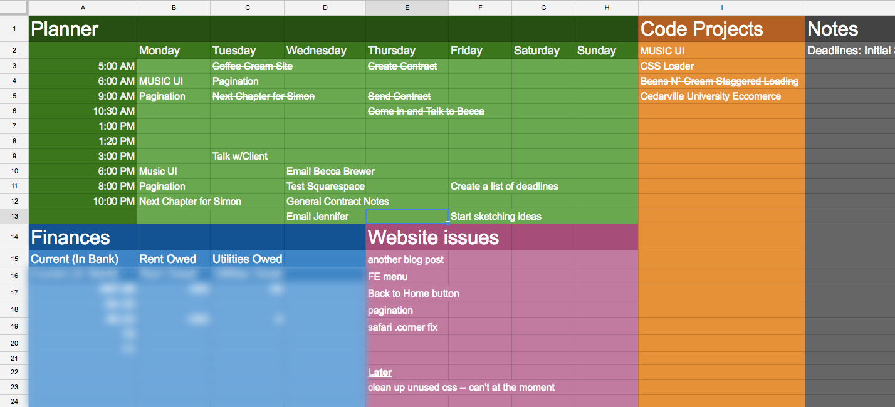

Creating todos are one of my favorite things todo and most likely they are yours as well. For a whole lot of us there is a joyous feeling of being organized and having things that make us feel busy. But simply, we hate actually doing them.

Unless those todos relate themselves to a passion, they will most likely not get done on time… or ever. The worst part about it all is that when we see long lists of todo items we get overwhelmed and slightly depressed when we don’t aren’t actually completing anything.

I always tell myself that finding the right todo application will actually make me productive. That it will make me want to get stuff done.

I’ve actually bought and downloaded multiple types of todo list applications over the last few years. None of them changed me, and in turn, I’ve given up on general todo lists that were designed to be used in a particular way.

> I’m tired of using a todo list as an excuse to not getting things done.

I think we need to stop treating a todo list as a life changing object. Todo lists won’t change our desire to be productive. Only practicing being productive will make us productive.

At the moment, I’m trying to not let a application define my mood. At the moment, I’ll just stick with Excel until I find a better practice.