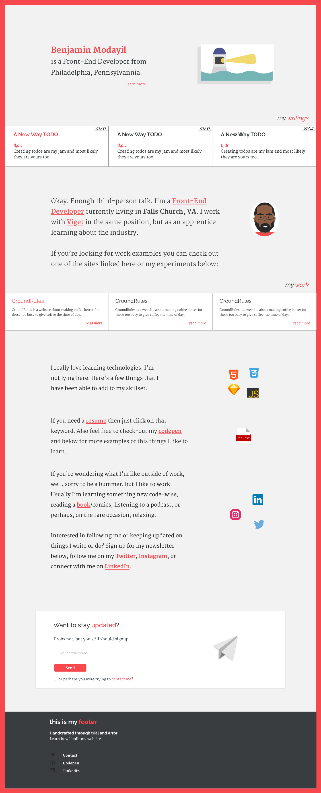

> **Note**: This site is currently being worked on (as of October 31st 👻). If you've managed to find your way here, stay tuned for some 👌🏾 looking things on November 6th.

# New Beginnings
If you've been on my site before, pre-November 2017, you'll notice things are quite different. In the past you might have seen a wide variety of adaptations of the site. *Currently*, I'm sticking with this one, but treating it like good ol' HTML, a living standard.

I don't know what this site will hold in the future, but I know what it's good for now, a place to learn, grow, experiment, and vent.

## A brief history
The first time I built my website was in Balsamiq Mockups. For those of you that don't know, Balsamiq Mockups is for making... mockups, but very low-fidelity versions. In fact, I would argue that they are just wireframes at their core.

That was when I was just learning how to make websites in my first web design class. Thank God, my teacher encouraged me to hold off on designing a portfolio site early on and point me into a more capable program for high-fidelity designs.

*Sadly, I do not have the old comps from Balsamiq to display. Just know that they looked like poor sketches with bright colors.*

Later on in my junior year, I went through marathon periods of trying to design and code a portfolio for myself and I would never settle on a design. 

The impossible thing of it all is the acknowledgement that we don't know how to design for ourselves. We are our own worst critics. As you can see from the listing of projects below, it is quite noticeable how much I self critique myself and my design capabilities.

Each of those directories either denote a new attemptive design direction, or an attempt of a feature change.

You might ask why not use `.git` and `github` to track these different branches/directions?

And I'd have to admit that my experience with `.git` and `github` were significantly lacking at the time.

Here are some of the design directions I've made so far:

*Thoughts behind the design:*
The primary purpose of this design was to showcase my love for animation on the web. I wasn't good at it, but I was the only one really doing web animation at my school, so it did put me apart from others around me.

After a critique from a bunch of my professors, I realized there was a small U.X. issue with the site as the navigation on the left lead to different pages instead of scrolling to the corresponding sections below.

🤦🏾‍♂️

*Thoughts behind the design:*
This actually wasn't the next design made, but I'm missing a couple of designs from when I used to work on Photoshop, so it's the next I could show. I wanted to see how it might look with a lighter colorscheme. I'm a pretty effeminate/unmanly man so I thought having a touch of pinkish tones wouldn't be too bad, color contrast was very problematic, plus a significant amount of other issues.

*Thoughts behind the design:*
I loved this color scheme. My top three favorite colors are black, dark navy blue, and toned red. So this covered part of those and stuck enough with me to an actual live site version.

This was actually the last version of my site to be live. I had a slow transition into my internship that I wasn't able to give it enough love as I originially intended, so I took my site down until I could address its issues.

I never did.

*Thoughts behind the design:*
This was another proposed design from the batch of of site creations that I liked a lot. The only issue with this one is that it got really complicated very fast. Like some of the past designs I had a "Labs" page and a "Work" page. The purpose of the "Labs" page was to showcase *experiments* and the work page to display actual *work* that I wanted people to judge me on. This became very messy that it pushed me to try to simplify these pages into one, but I didn't actually get to do that until my final design (no it's not the next one)...

*Thoughts behind the design:*
I went back to my favorite color scheme on this one. While I felt this design stacked better and looked more sectioned off, it still sold itself on not being as simple as it could be.

At this point, I just realized that I only needed a place to write blog posts and place some case studies.

I also realized that I didn't care about anyone else's opinions on how my site looked and I used that as an excuse for not actually having anything live.

*Thoughts behind the design:*
So here's what I'm working with now. 

Know how much I don't care about what others think about my design choices? I have a freaking red border around my site. Take that insecurity you're going to have to deal with that now. Or at least until you feel like changing the design up again.

*You know what I might actually switch from that border sooner than later. I need to do some testing on this.*

> Website is now like HTML5, a living standard.

**Fonts:**
Raleway and Merriweather

<blockquote class="twitter-tweet" data-lang="en">
When you realize it&#39;s 9:30am and you already had three cups of coffee ☕
&mdash; Benjamin Modayil 🤷 (@modayilme) <a href="https://twitter.com/modayilme/status/922816270965276672?ref_src=twsrc%5Etfw">October 24, 2017</a></blockquote>

**Colors** (*give or take a few digits with how Chrome/Safari adjusts colors slightly*: 

Mineshaft: #393D3F
Botticelli: #C9D9DE

