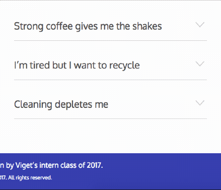
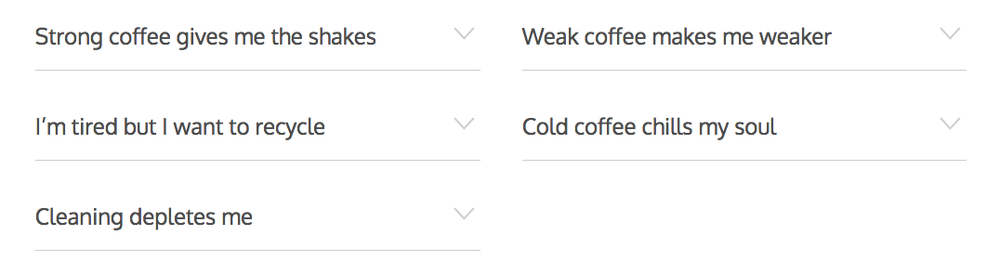
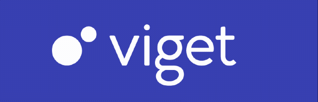

## Let's set some Ground Rules

Get it? Like it's a pun... and the title of the project.

It was an ongoing joke for the project. At Viget, interns aren't expected to fetch coffee, or do miscellaneous tasks, we were there to learn and create something cool.

For this project, I was one of two Front-End Developers on a team of interns with varying roles. On top of the Front-End, we had a copywriter, UX designer, designer, and rails developer.

## Lessons Learned

We had many lessons learned, but the following highlights a few. On top of it all, we were a team spread over three locations fighting to stay on the same page and to progress forward.

### Collaboration

Working with a variety of people tends to be a problem when lines aren't drawn. When you have a specific role, in my case FED. It’s clear that you don’t necessarily have a role in the product direction, but are the one helping build the product.

Problem was that each intern, while having specific UX, DESIGN, COPY, FED, and DEV roles, had a say in what we wanted to make.  While it was awesome to have that power, it was hard to collaborate when each intern wanted to take our Coffee website in different directions.

<q>
  We should teach people how to use an aeropress!
</q>

<q>
  We should teach people how to make fancy coffee drinks!
</q>

<q>
<strong>We should teach people how to make good coffee with the tools they already have.</strong>
</q>

In the end, we each learned to show a little compromise and rally around our unifying idea, **coffee**.

#### Two FEDs?!

An aspect of this collaboration issue was that there were two front-end developers for the intern class.

Initially, my worry was that there would be problems of workload and someone else would be getting to code the part of the website that the other wanted to. This didn’t end up being the case. The other Front-End developer, Cyron, was great to work with. We had great back and forths that made the project smooth to work on.

Time did end up becoming an issue, as our designer had a family reunion in a another timezone that couldn’t be avoided in the middle of her design phase, but despite this, she still worked hard in providing us the comps that we needed.

#### Git Gud

There was an aspect of Git that I never really tackled before. I knew how to setup a project, commit, push, and pull, but soon realized I didn’t know much about Git in the context of a team.

It all came down to one command that at least two of the three total developers didn’t use as much `git rebase [branch]`.

We ran into issues early on where rebasing became a long overdrawn process and we would have two or three people on a call just going through all the merge conflicts created in the process. 

Eventually, we all got on the same page with `git` usage in the project and things started to go smoothly 👌🏾.

### SVG

Our biggest time-consumer for the FED build cycle were working with SVGs.

The first issue was getting everyone on the same page about SVGs. At the start of the project, we knew we wanted to use them for animation as we originally intended the site to be performant, but there was a FED/Designer divide on how to go about these SVGs. Common issues with SVG handoffs seems to deal with how many node-points a path has, layer naming, flattening of paths, and random things in between. Plus when you’re going to be animating something, there is a need for the SVG file to be accounting for any animation.

With that was the issue of SVG programs. The original vectors were created with Illustrator CC, but to work with the files, the FEDs were limited to Figma. I even took them from Illustrator and brought them into Sketch. This created huge problems as we didn’t know about it at the time, each program handled SVG exports slightly differently.

*Here’s a good podcast from [Shoptalk](http://shoptalkshow.com/episodes/270-svg-sketch-peter-nowell/) that discusses this a little bit.*

Among our issues, when it came time to finally get our animations working, they had issues rendering in specific browsers. Chrome for example would render out one of our SVGs into looking like it exploded into sharp shards while Safari rendered normally. In the end, we removed the unreliable SVGs and kept the ones the worked well due to the time we had left.

The whole experience of working with SVGs on this project sure makes me want to reread Chris Coyier’s book [Practical SVG](https://abookapart.com/products/practical-svg).
 
This also made me realize that it’s best to minimize SVGs by hand. Well, after getting a decent export. In Illustrator/Sketch/Figma/whatever, there are tons of different ways of compressing your SVG, whether that’s combining paths, flattening paths/layers, or just removing unnecessary things like that raster `.jpg` pattern a designer included in without realizing that would ruin the idea of a scalable vector…

From there there are great tools that can take things further like [SVGOMG - SVGO’s Missing GUI](https://jakearchibald.github.io/svgomg/), but perhaps we were too liberal with trust in the compressor for handling our SVGs. Sometimes it’s better to be exporting by hand. SVG compressors tend to copy similar elements and use `link` to be frugal with space. The problem with this is that a good number of times we couldn’t debug in the browser because the usage of `link`  would place us into the **[shadow DOM](https://developer.mozilla.org/en-US/docs/Web/Web_Components/Shadow_DOM)**. *Insert Stranger things music*

## Personal Pride

My favorite portion of the website was figuring out the <a href="https://groundrules.co/devices">Machines</a> portion of the site. What made this page interesting was that it was a pretty interactive page with tons of tabs. When one of the machines were clicked, they would bring up an interactive problem statements that could be clicked on and allow a user to peer within for an answer and even for some of these problem statements were cute coffee-related animations.

An interesting issue for this page was to find a way to respect the reading order of the list items. The order of items the designer gave was a top to down then left to right ordering of list items. When using floats, you need to be working with a left to right then top to down approach. The designer was totally okay with changing the order of items to work with the limitations of using floats, but I figure out a way of using rails templating to preserve the order by rendering two lists based on the data coming from our ActiveAdmin CMS/DB. It’s nothing anyone would notice, but felt like a great solution to a tricky ordering solution that could only be solved with templating.

### Accessibility

This was my first project that I got to make more accessible. The goals were to make the website more accessible. To do this we used a combination of `ARIA`  attributes. If you check out the machines [page](https://groundrules.co/devices) you’ll notice that you can tab all the way through the page. 

You’ll probably notice the red outline or dotted outline when selecting elements with the keyboard. If you were to select another element with your mouse there is no outline. Why do this differently for alternate inputs? Because apparently the outline was too ugly. So this was the FED approach to still incorporate accessibility despite feedback to having any outline at all. So only if someone needed to navigate the website with their keyboard would any tab outlines show. This was done using Viget’s [WhatInput](https://ten1seven.github.io/what-input/) which allows you to style/create interactions based on the mouse, keyboard, or touch events.

## Summary

I’ll probably re-edit this page and provide more examples as I see fit, but here’s a summary of the things FEDs had to tackle in this project:

1. Collaboration, especially with `git`
2. SVG animations and debugging those animations.
3. How to make an interactive site accessible.

Some other things I’ll just touch on shortly were two things:

1. [Codepen](https://codepen.io/) as a tool to quickly prototype ideas and animations.
2. [BEM — Block Element Modifier](http://getbem.com/naming/) as a method of making our classes more understandable to anyone else working with the project.

If you're looking for other writings about the execution of this project check out the [introduction of GroundRules]((https://www.viget.com/articles/world-meet-ground-rules)) by Elyse or a [design case study](http://vivianzwang.com/ground-rules) by Vivian.