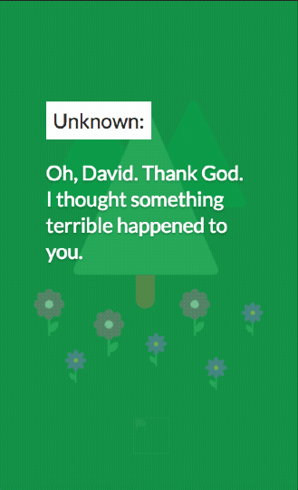
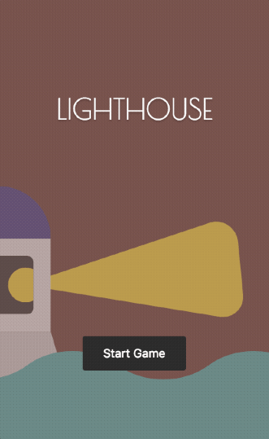
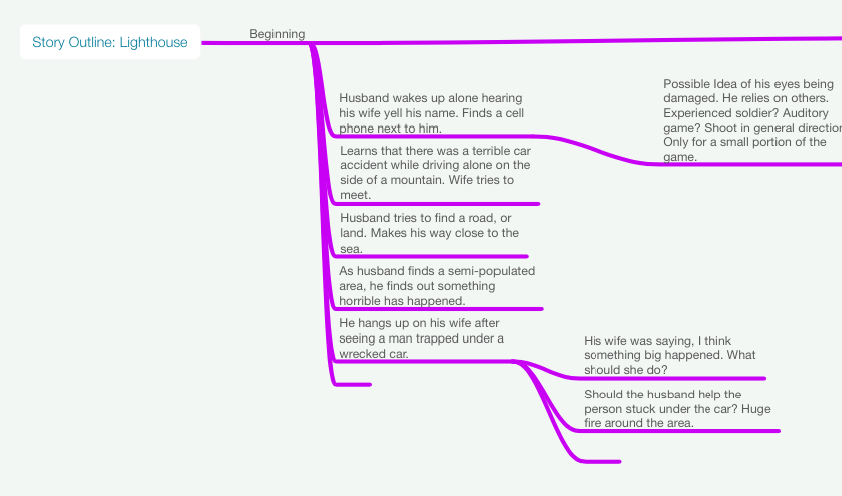
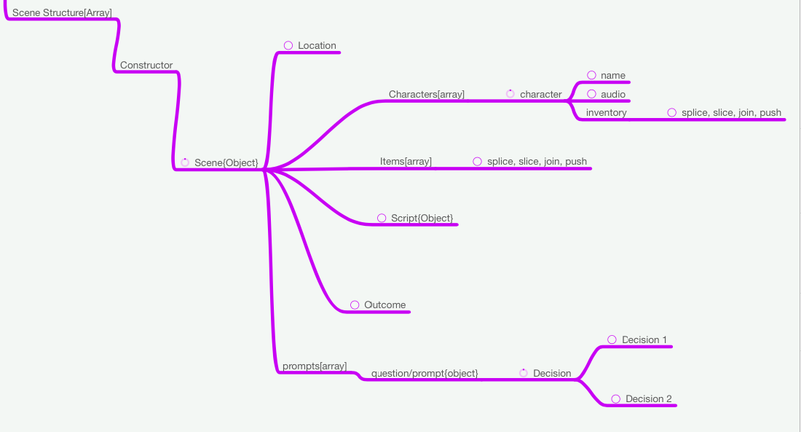

## To learn Javascript

Around my Junior year of college, I wanted to Javascript a lot more.  I already knew how to do basic D.O.M manipulation through jQuery, but I felt as though I were using a crutch. 

Around this time as well, I’ve been hearing more and more about the whole jQuery size dependency issue and realized if all I was needing Javascript was for adding, removing, and toggling classes, then why would I resort to use such a unnecessary dependency just to make things interactive? Why not write the extra code to trigger something after all these were how adding a class looked for jQuery and vanilla Javascript.

Assuming you had a nav stored as a variable with both:

jQuery
```
$nav.addClass( 'color--red' );
```

javascript
```
nav.classList.add('color--red');
```

Yup. It was that easy. But at the time, a StackOverflow made me worry about support and I resorted to use small pre-written functions for this project. 

## It was a text-based game

The core-idea of this project was to create a text-based game with ambient visuals. As the end goal was for something to be displayed on a phone, I realized screen real-estate should be devoted to the text and any visuals should be second in nature to a user.



My primary goal was to learn more about Javascript. Secondary, was to create a somewhat coherent story, which I did, but in an “episode” format.  So in reality, the game feels short, but it is as most “episode” like games tend to be.

One of the difficulties was figuring out the best way of storing game data. I wanted to at the time explore using JSON files, but I honestly just didn’t get Javascript that much at the time to do this, and in the end, I just stored the game text/options in the same `.JS` file.



Looking back, there’s a ton of things that I could have done better, but that’s the ongoing issue with development:

> There’s always something that can be done better, but do you have the time or knowledge to make it better?

My issue was mainly the latter, knowledge. Because of this, my plan is to add to this project with the knowledge I have now of better patterns within Javascript.

## Struggles

Two struggles were precedent throughout the project.

1. Learning Javascript.
2. Writing a decent story and mapping out choice logic.

Here are some screenshots of the latter:





## Here’s a little sneak peak

Below <span role="img" aria-label="point down">👇🏾</span> is a preview of a little redesign of the project that I’m working through. Let me know if you wish to see the original code and I can push it up to Github sometime.

<iframe height='700' scrolling='no' title='Lighthouse Hill' src='//codepen.io/modayilme/embed/ybXErO/?height=265&theme-id=dark&default-tab=result&embed-version=2' frameborder='no' allowtransparency='true' allowfullscreen='true' style='width: 100%;'>See the Pen <a href='https://codepen.io/modayilme/pen/ybXErO/'>Lighthouse Hill</a> by Benjamin Modayil (<a href='https://codepen.io/modayilme'>@modayilme</a>) on <a href='https://codepen.io'>CodePen</a>.
</iframe>
